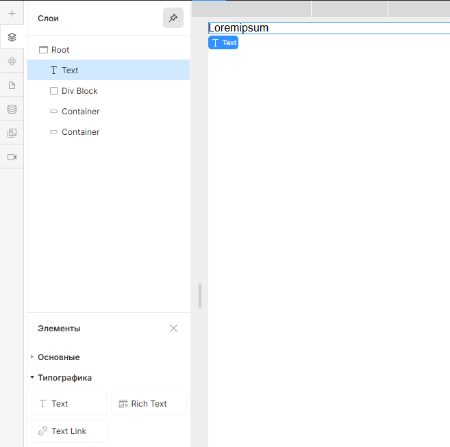
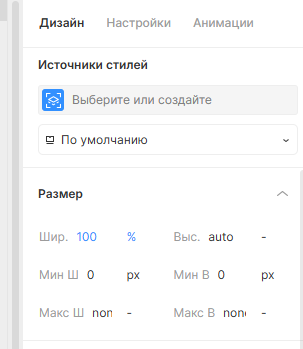
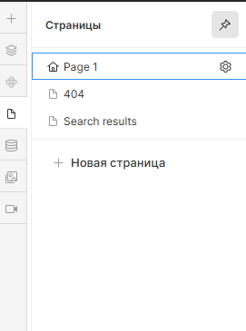
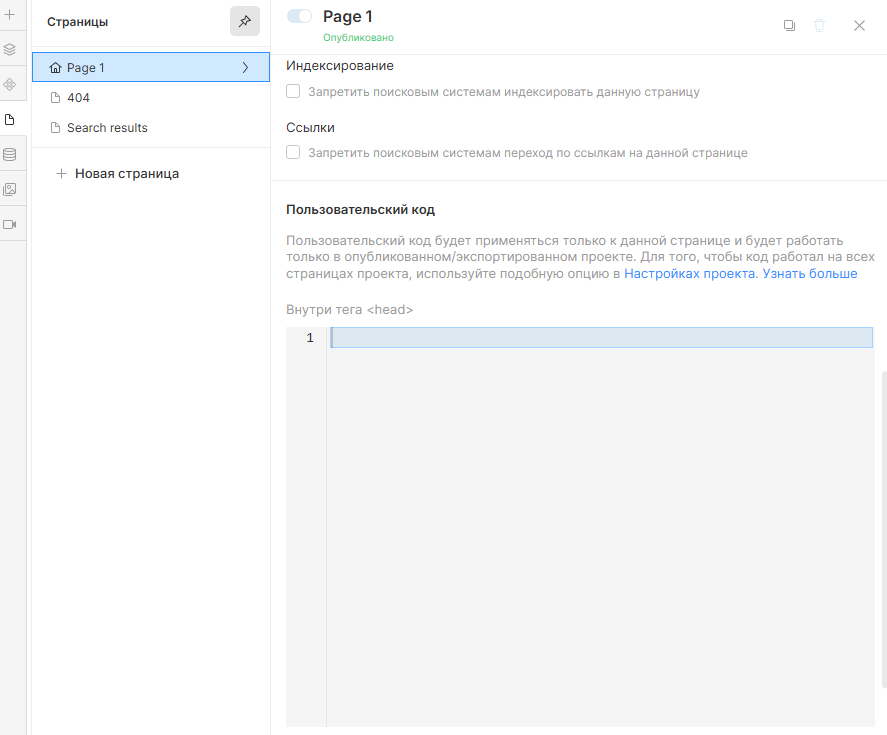

# Text Animation

## Работает только с текстовыми элементами (элементы/типографика/текст)

## Генератор кода для анимации текста прокрутки с заменой

## Как использовать

Для корректной работы текстовой анимации с использованием скрипта необходимо в HTML-разметке добавить:
<!-- markdownlint-disable MD040 -->
```
<p class="js-counter-text-animation-t2 js-script">Loremipsum</p>
```
<!-- markdownlint-disable MD041 -->
<!-- markdownlint-disable MD033 -->
<figure>
  
  <figcaption>В конструкторе в навигационной панели слева необходимо во вкладке Слои создать Элемент - Типографика - Текст</figcaption>
</figure>

<figure>
  
  <figcaption>В конструкторе в навигационной панели справа необходимо во вкладке Дизайн -> Источники
  стилей задать название класса `js-counter-text-animation-t2 js-script` Элемента Text.</figcaption>
</figure>

1. **Введите идентификатор анимацию**

   В поле "Идентификатор анимации" укажите `js-script`, что должно соответствовать классу элемента, который вы хотите анимировать. В данном случае это `js-counter-text-animation-t2` и `js-script`.

2. **Задайте значение скорости задержки анимации**

   В поле "Скорость задержки анимации" укажите значение в формате `0.5`, которое должно быть задано для задержки анимации. По умолчание значение равно `0.1`.

3. **Задайте значение скорости анимации**
    В поле "Скорость анимации" укажите значение в формате `3.0s`, которое должно быть задано для скорости анимации. По умолчание значение равно `2.5s`.

4. **Задайте значение прозрачности анимации второго слоя**
    В поле "Начальная прозрачность анимации второго слоя" укажите значение прозрачности в формате `0.2`, которое должно быть задано для начальной прозрачности анимации. По умолчание значение равно `0`.

5. **Отметьте  эффект замедления в середине анимации**

   В поле "Отметить эффект замедления в середине анимации" нужно поставить галочку, если вы хотите, чтобы анимация замедлялась в середине. По умолчанию анимация не имеет эффект замедления.

6. **Отметьте  эффект замедления в конце анимации**

    В поле "Отметить эффект замедления в конце анимации" нужно поставить галочку, если вы хотите, чтобы анимация замедлялась в конце. По умолчанию анимация не имеет эффект замедления.

7. **Вставка сгенерированного кода**

<!-- markdownlint-disable MD041 -->
<!-- markdownlint-disable MD033 -->
<figure>
  
  <figcaption>В конструкторе в навигационной панели слева необходимо во вкладке Страницы выбрать страницу для вставки кода.
  При наведении на название страницы появляется шестеренка, по которой необходимо кликнуть, чтобы открыть вкладку для настройки страницы</figcaption>
</figure>

<figure>
  
  <figcaption>Во вкладке настройки страницы в разделе Пользовательский код нужно вставить сгенерированный код</figcaption>
</figure>

---

## Форма для генерации кода

<!-- markdownlint-disable MD041 -->
<!-- markdownlint-disable MD033 -->

<div id="t2-generator">
  <label for="t2-animationID" style="font-weight:bold; color: #000;">Идентификатор анимации</label>
  <input type="text" id="t2-animationID" value="" placeholder="js-script">
  <label for="t2-animationDalay" style="font-weight:bold; color: #000;">Скорость задержки анимации</label>
  <input type="text" id="t2-animationDalay" value="" placeholder="0.01">
  <label for="t2-animationSpeed" style="font-weight:bold; color: #000;">Скорость анимации</label>
  <input type="text" id="t2-animationSpeed" value="" placeholder="2.5s">
  <label for="t2-startOpacityt2" style="font-weight:bold; color: #000;">Начальная прозрачность анимации второго слоя</label>
  <input type="text" id="t2-startOpacityt2" value="" placeholder="0.5">
  <div class="checkbox">
    <div class="checkbox_wrapper">
        <input type="checkbox" id="t2-slowdownEffect" value="false">
        <label for="t2-slowdownEffect" style="font-weight:bold; color: #000;">Применять эффект замедления в середине анимации</label>
    </div>
    <div class="checkbox_wrapper">
        <input type="checkbox" id="t2-endSlowdownEffect" value="false">
        <label for="t2-endSlowdownEffect" style="font-weight:bold; color: #000;">Применить эффект замедления в конце анимации</label>
    </div>
  </div>
  <button id="generate-t2">Сгенерировать код</button>
  <button id="copy-t2">Копировать код</button>
  <h2 id="title" style="display: none">Пример сгенерированного кода</h2>
  <pre id="t2-output"></pre>
</div>
