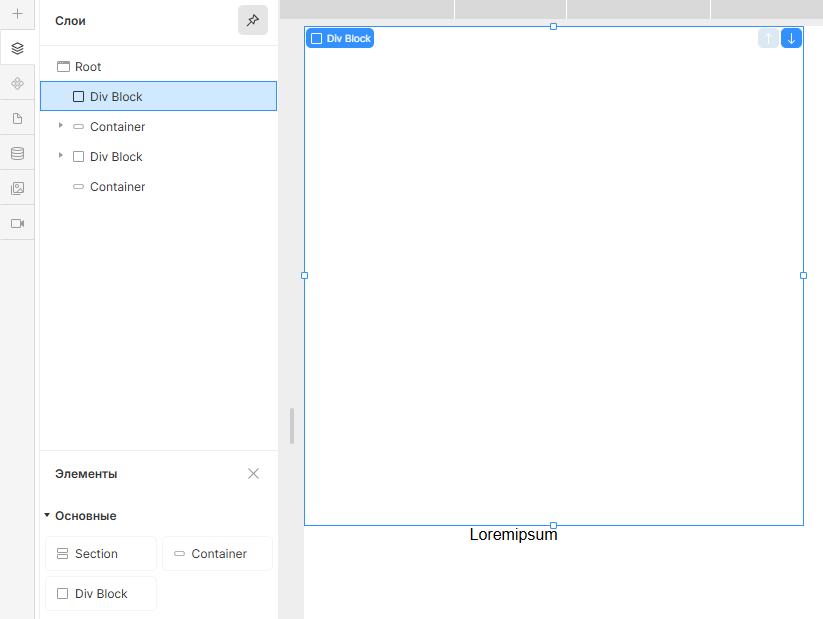
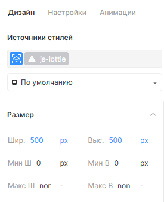

# Lottie Animation

## Работает только элементами (элементы/основные/блок-секция-контейнер)

## Генератор кода для Lottie анимаций

Этот генератор позволяет быстро получить код для вставки Lottie-анимации в ваш проект. Просто укажите ссылку на `.json` или `.lottie` файл, имя класса для контейнера и ID для canvas — и получите готовый фрагмент для вставки.

Для корректной работы Lottie-анимации с использованием скрипта необходимо в HTML-разметке добавить:
<!-- markdownlint-disable MD040 -->

```
<div class="js-lottie"></div>

```
<!-- markdownlint-disable MD041 -->
<!-- markdownlint-disable MD033 -->
<figure>
  
  <figcaption>В конструкторе в навигационной панели слева необходимо во вкладке Слои создать Элемент DivBlock.</figcaption>
</figure>

<figure>
  
  <figcaption>В конструкторе в навигационной панели справа необходимо во вкладке Дизайн -> Источники
  стилей задать название класса `js-lottie` Элемента DivBlock.</figcaption>
  <figcaption>Также необходимо задать селектору класса `js-lottie` `width` и `height` в пикселях (`px`)</figcaption>
</figure>

## Как использовать

1. **Введите ссылку на анимацию**  
   Поддерживаются прямые ссылки на `.json` или `.lottie` файлы.

   Пример: <https://lottie.host/3b708674-ffd6-4a3b-90b4-4d926c311ff5/tRKFgr4YCB.lottie>

2. **Укажите имя класса для контейнера**  
Это класс элемента, внутри которого появится анимация.  
Пример:  `js-lottie`

3. **Укажите ID для canvas**  
Это будет идентификатор элемента `<canvas>`, где будет рендериться анимация.  
Пример:  canvas

4. **Определите поведение анимации Lottie**  
Выбрав `Ничего не делать`, анимация будет запущена и ее нельзя будет поставить на паузу.
Выбрав `Переключить play/pause`, анимация будет запущена и ее можно будет поставить на паузу, кликнув по ней.

5. **Нажмите "Сгенерировать код"**  
Внизу появится готовый код для вставки.

6. **Скопируйте код**  
Нажмите "Копировать код", чтобы скопировать сгенерированный фрагмент.

---

<!-- ## Пример сгенерированного кода -->
## Форма для генерации кода

<!-- markdownlint-disable MD041 -->
<!-- markdownlint-disable MD033 -->

<div id="dotlottie-generator">
  <label for="lottie-url" style="font-weight:bold; color: #000">URL анимации (.json или .lottie):</label>
  <input type="text" id="lottie-url" value="https://lottie.host/3b708674-ffd6-4a3b-90b4-4d926c311ff5/tRKFgr4YCB.lottie">
  <label for="lottie-div" style="font-weight:bold; color: #000">Имя класса для div-контейнера Lottie:</label>
  <input type="text" id="lottie-div" value="js-lottie">
  <label for="lottie-canvas" style="font-weight:bold; color: #000">Имя для canvas-контейнера Lottie:</label>
  <input type="text" id="lottie-canvas" value="canvas">
  <div style="margin: 10px 0;">
    <label style="font-weight:bold; color: #000">Поведение при клике на анимацию:</label>
    <div>
      <input type="radio" id="click-none" name="click-behavior" value="none" checked>
      <label for="click-none">Ничего не делать</label>
    </div>
    <div>
      <input type="radio" id="click-toggle" name="click-behavior" value="toggle">
      <label for="click-toggle">Переключать play/pause</label>
    </div>
  </div>
  <button id="generate-dotlottie">Сгенерировать код</button>
  <button id="copy-dotlottie">Копировать код</button>
  <h2 id="title" style="display: none">Пример сгенерированного кода</h2>
  <pre id="dotlottie-output"></pre>
</div>
